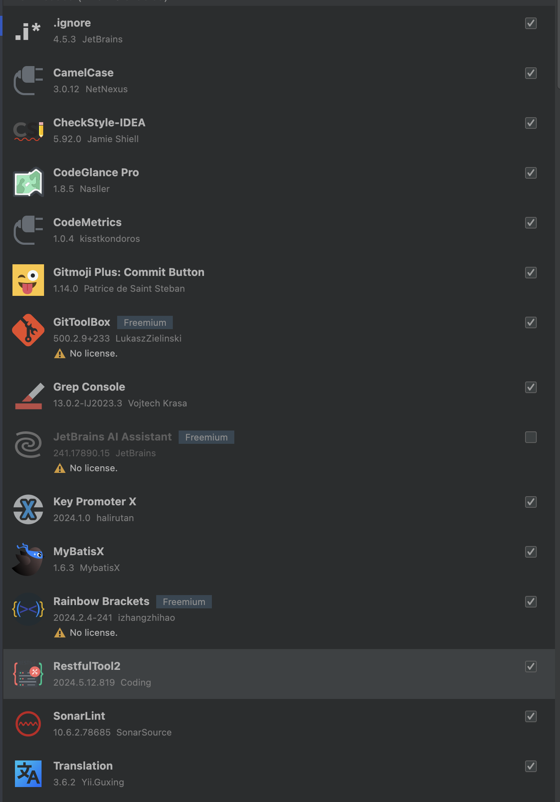

### 사용중인 플러그인 정리

## IntellJ

- `opt + cmd + T ` : Surround With
- `opt + 위 -> ctrl + w 로 변경` : Extend Selection
- `opt + cmd + /` :  Main Menu - Navigate - Go to Endpoint

- `ctrl + t ` :  Refactor this
- `opt + shift + u` : CamelCase 변환 (CamelCase 플러그인 설치 필요)

- `shift + cmd + 위,아래 ` : 메서드 위치 변경

## Bookmark

- `opt + F3` : Add Mnemonic Bookmark
- `cmd + F3` : Show Line Bookmarks
- `ctrl + 1,2,3…` : Go To Bookmark

## Mac

- `cmd + shift + 4` : 화면 캡쳐
- `ctrl + cmd + shift + 4` : 화면 캡쳐 클립보드
- `cmd + m` : 창 최소화
- `cmd + shift + .` : 숨김 파일 보기
- `cmd + q` : 창 끄기
- `cmd + r` : 새로고침
- `cmd + ]` : 뒤로 가기