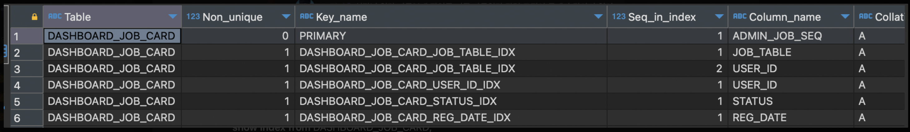

``` java
    
    인덱스 확인
    show index from DASHBOARD_JOB_CARD;
    
    인덱스 생성
    ALTER TABLE DASHBOARD_JOB_CARD
    ADD INDEX DASHBOARD_JOB_CARD_USER_ID_IDX (USER_ID);


    DASHBOARD_JOB_CARD_JOB_TABLE_IDX
    이는 복합 인덱스(composite index)입니다.
    컬럼 순서: (JOB_TABLE, USER_ID)
    이 인덱스는 두 컬럼을 함께 사용하는 쿼리에 최적화되어 있습니다.


    DASHBOARD_JOB_CARD_USER_ID_IDX
    이는 단일 컬럼 인덱스입니다.
    컬럼: USER_ID
    
    주요 차이점
    - 용도 
        DASHBOARD_JOB_CARD_JOB_TABLE_IDX는 JOB_TABLE과 USER_ID를 함께 조회하는 쿼리에 유용합니다.
        DASHBOARD_JOB_CARD_USER_ID_IDX는 USER_ID만으로 조회하는 쿼리에 유용합니다.


```